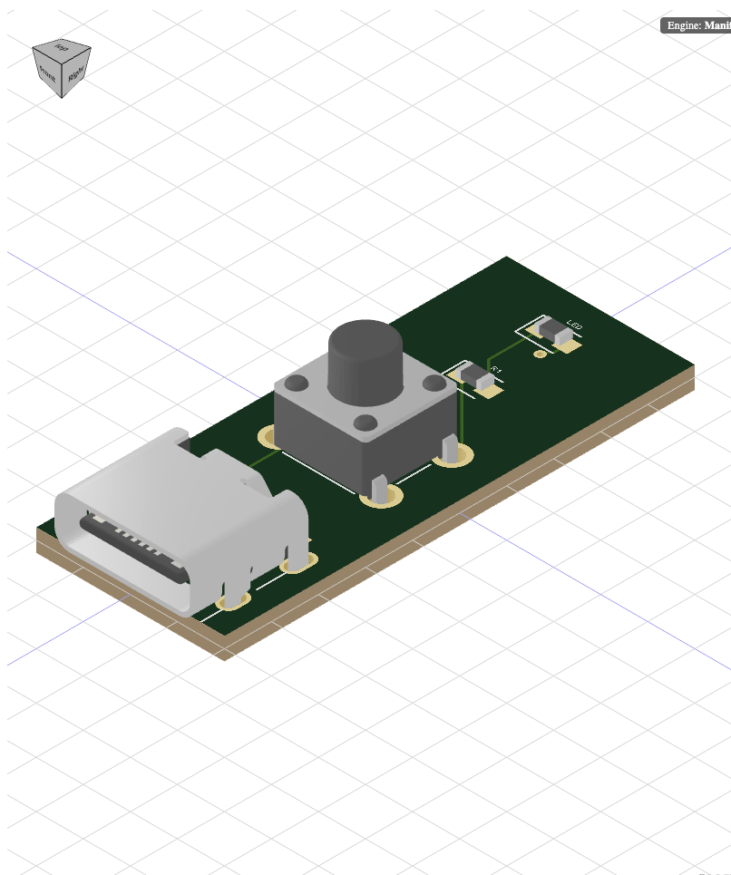
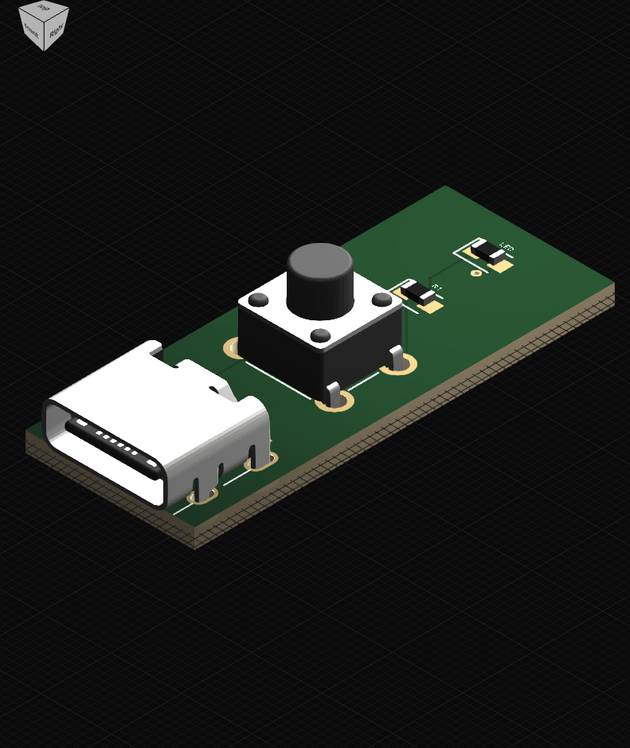

# @aleontaridis/pcb-3d-viewer

**Built on top of** [`@tscircuit/3d-viewer`](https://www.npmjs.com/package/@tscircuit/3d-viewer) ([GitHub](https://github.com/tscircuit/3d-viewer)): same Circuit JSON / tscircuit integration model, with rendering and viewer UI changes described below.

An updated 3D printed circuit board viewer for [Circuit JSON](https://github.com/tscircuit/circuit-json) and [tscircuit](https://github.com/tscircuit/tscircuit).

## Visual comparison

Same demo board (USB-C, tactile switch, **R1**, **LED**): **before** = upstream viewer, **after** = this fork.

| Before (original library) | After (this library) |
| --- | --- |
|  |  |

## What changed in this fork

**Rendering and materials.** The look of the viewer was rebuilt in passes: **lighting** and the **background grid** were updated, the **WebGL canvas** and **renderer** settings were tuned for clearer exposure and contrast, and the **board plus parts** (footprints, imported models, and board textures) were adjusted so everything reads more like real objects than flat shapes. Parts now pick up scene lighting in a more uniform way, and surface colors drive more believable **metal vs plastic** shading so resistors, connectors, and the board do not all look the same. **Board shading** was split so **painted textures** and **solid mesh** stay aligned instead of fighting each other.

**Copper, board laminate, and solder mask.** **Copper** color is defined in one place and reused wherever copper appears in both **flat overlays** and **3D**, so the 2D layers and the 3D metal tint match. The **fiberglass edge** of the board uses explicit laminate coloring so the side of the PCB reads as stacked material, not one flat green slab. **Solder mask**, **height**, and **shininess** maps were expanded so mask, bumps, and copper interact: as you **orbit the camera**, you get more depth and specular variation on the green surface.

**Engine simplification.** The old **Manifold-based** mesh path (used for some hole and via geometry) was **removed completely**. The viewer that ships now is built on **JSCAD** and **Three.js** only; the main viewer shell was rewired, dependencies and dev stories were cleaned up, and a large block of unused geometry code was deleted.

**Silkscreen and labels.** Silkscreen and related overlays got a reliability pass: an outdated bounds helper was removed, and the pipelines that draw **silkscreen**, **mask**, **assembly notes**, and **fab notes** were rewired so **reference designators and text** land at **stable size and position**. The silkscreen Storybook example is the best quick visual check for label quality.

**Camera and menus.** **Orbit**, **view presets**, and the **corner orientation control** were reworked so camera motion and preset jumps feel smoother and more predictable. During the parallel-branch period, the experimental UI and the main tree were kept in step so menus and the gizmo did not drift apart. A later pass simplified how the outer viewer wires into the **context menu** while keeping **camera presets**, **auto-rotate**, **export**, and **layer / appearance** toggles.

**For app authors.** What you import and render—the main **viewer component**, **circuit JSON**, and **board markup**—stays the same idea as upstream even though the internals changed. Install and examples below.

## Features

- 3D visualization of PCB layouts
- Interactive camera controls (pan, zoom, rotate)
- Support for various PCB components (resistors, capacitors, Chips, etc.)
- Customizable board and component rendering

## Installation

```bash
npm install @aleontaridis/pcb-3d-viewer
```

## Usage

### Basic Example

```jsx
import React from "react"
import { CadViewer } from "@aleontaridis/pcb-3d-viewer"

const MyPCBViewer = () => {
  return (
    <CadViewer>
      <board width="20mm" height="20mm">
        <resistor
          name="R1"
          footprint="0805"
          resistance="10k"
          pcbX={5}
          pcbY={5}
        />
        <capacitor
          name="C1"
          footprint="0603"
          capacitance="1uF"
          pcbX={-4}
          pcbY={0}
        />
      </board>
    </CadViewer>
  )
}

export default MyPCBViewer
```

### Using with circuitJson Data

```jsx
import React from "react"
import { CadViewer } from "@aleontaridis/pcb-3d-viewer"
import mycircuitJsonData from "./mycircuitJsonpData.json"

const MyPCBViewer = () => {
  return <CadViewer circuitJson={mycircuitJsonData} />
}

export default MyPCBViewer
```

### Converting to SVG (Node.js)

When using the SVG converter in Node.js environments, you'll need to provide JSDOM:

```typescript
import { JSDOM } from "jsdom"
import {
  convertCircuitJsonTo3dSvg,
  applyJsdomShim,
} from "@aleontaridis/pcb-3d-viewer"

// Setup JSDOM environment
const dom = new JSDOM()
applyJsdomShim(dom)

// Convert circuit to SVG
const options = {
  width: 800,
  height: 600,
  backgroundColor: "#ffffff",
  padding: 20,
  zoom: 50,
  camera: {
    position: { x: 0, y: 0, z: 100 },
    lookAt: { x: 0, y: 0, z: 0 },
  },
}

const svgString = await convertCircuitJsonTo3dSvg(circuitJson, options)
```

The `convertCircuitJsonTo3dSvg` function accepts the following options:
- `width`: Width of the output SVG (default: 800)
- `height`: Height of the output SVG (default: 600)
- `backgroundColor`: Background color in hex format (default: "#ffffff")
- `padding`: Padding around the board (default: 20)
- `zoom`: Zoom level (default: 1.5)
- `camera`: Camera position and lookAt configuration
  - `position`: {x, y, z} coordinates for camera position
  - `lookAt`: {x, y, z} coordinates for camera target

## API Reference

### `<CadViewer>`

Main component for rendering the 3D PCB viewer.

Props:

- `circuit-json`: (optional) An array of AnyCircuitElement objects representing the PCB layout.
- `children`: (optional) React children elements describing the PCB layout (alternative to using `circuit-json`).
- `resolveStaticAsset`: (optional) Function that receives each component model URL (`obj`, `wrl`, `stl`, `gltf`, `glb`, `step`) and returns the resolved URL to load.

### `<board>`

Defines the PCB board dimensions.

Props:

- `width`: Width of the board (e.g., "20mm").
- `height`: Height of the board (e.g., "20mm").

### Component Elements

Various component elements can be used as children of the `<board>` element:

- `<resistor>`
- `<capacitor>`
- `<chip>`
- `<bug>` (for ICs)

Each component has specific props for defining its characteristics and position on the board.

## Advanced Usage

### Custom Component Models

You can define custom 3D models for components using the `cadModel` prop:

```jsx
<chip
  name="U1"
  footprint="soic8"
  cadModel={{
    objUrl: "/path/to/custom-model.obj",
    mtlUrl: "/path/to/custom-material.mtl",
  }}
/>
```

### JSCAD Models

For more complex or programmatically defined models, you can use JSCAD:

```jsx
<bug
  footprint="soic8"
  name="U1"
  cadModel={{
    jscad: {
      type: "cube",
      size: 5,
    },
  }}
/>
```

## License

This project is licensed under the MIT License - see the [LICENSE](LICENSE) file for details.
